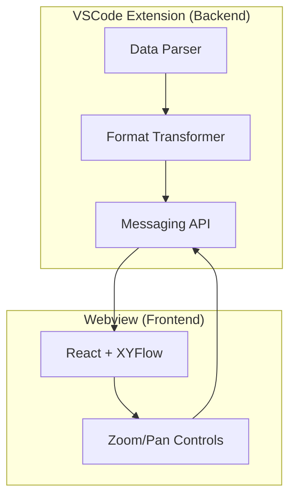

# JSON Flow

[](https://marketplace.visualstudio.com/items?itemName=imgildev.vscode-json-flow)
[](https://marketplace.visualstudio.com/items?itemName=imgildev.vscode-json-flow)
[](https://marketplace.visualstudio.com/items?itemName=imgildev.vscode-json-flow)
[](https://marketplace.visualstudio.com/items?itemName=imgildev.vscode-json-flow&ssr=false#review-details)
[](https://github.com/ManuelGil/vscode-json-flow)
[](https://github.com/ManuelGil/vscode-json-flow/blob/main/LICENSE)

---

## Introduction

**JSON Flow** is a robust and feature-rich extension for Visual Studio Code and all editors based on the VSCode platform (including VSCodium, WindSurf, Cursor, and others). It enables interactive visualization, conversion, and management of structured data files such as JSON, YAML, XML, CSV, and more. Leveraging a node-based graph interface and advanced data transformation tools, JSON Flow streamlines the process of exploring, converting, and generating code from complex data structures. This extension is tailored for developers, data engineers, and analysts seeking enhanced clarity, productivity, and efficiency in their daily workflows.


---

## Highlights

- **Interactive graphs** for JSON and other structured formats (YAML, XML, CSV, TOML, INI, ENV, JSON5/JSONC).
- **One-click conversions** between JSON and popular formats; copy as JSON anywhere.
- **Code generation** from JSON (TypeScript, Go, JSON Schema, and more).
- **Split View + Live Sync (roadmap)** to mirror selection and edits between editor and graph.
- **Works across VS Code family** (VS Code, VSCodium, WindSurf, Cursor) on Windows, macOS, and Linux.
- **Private by design**: 100% local processing, no telemetry, no uploads.
- **Built for scale**: Incremental rendering for large/complex data; no hard size caps.

---

## Why choose JSON Flow for VS Code

- **Offline-first & open source (MIT)**: Processing happens locally in VS Code. Codebase is open for audit and contributions.
- **VS Code-native UX**: Activity Bar views, Explorer context menus, editor title actions, and keybindings for a smooth workflow.
- **Broad multi-format scope**: JSON/JSONC/JSON5, YAML, XML, CSV/TSV, TOML, INI, .env, HCL, and more with unified operations.
- **Split View today, Live Sync tomorrow**: Toggle split view now; selection and edit synchronization are on the roadmap (see versions 2.3-2.4).
- **Code generation built-in**: Generate TypeScript, Go, JSON Schema and more directly from JSON.
- **Workspace-ready**: Supports untrusted and virtual workspaces (limited), respects ignore rules, and is configurable per workspace.
- **Accessibility & theming roadmap**: High Contrast and token-aware theming improvements planned (see 2.5.0).

## Why JSON Flow?

Exploring complex data structures in code or configuration files can be cumbersome. JSON Flow converts supported files into interactive graphs, enabling you to:

- **Visualize** nested data relationships with zoom, pan, and expand/collapse controls.
- **Convert** between formats (YAML, TOML, INI, XML, CSV, etc.) and JSON in one click.
- **Inspect** file properties and copy content or JSON representation directly from the editor.
- **Generate** code artifacts (TypeScript interfaces, Go structs, JSON Schema, and more) from JSON data.

---

## Table of Contents

- [JSON Flow](#json-flow)
  - [Introduction](#introduction)
  - [Highlights](#highlights)
  - [Why choose JSON Flow for VS Code](#why-choose-json-flow-for-vs-code)
  - [Why JSON Flow?](#why-json-flow)
  - [Table of Contents](#table-of-contents)
  - [Key Features](#key-features)
    - [Interactive Data Visualization](#interactive-data-visualization)
    - [File Conversion \& Management](#file-conversion--management)
    - [Code Generation](#code-generation)
    - [Supported Formats](#supported-formats)
    - [Advanced Configuration](#advanced-configuration)
    - [Architecture Overview](#architecture-overview)
      - [High-Level Architecture](#high-level-architecture)
      - [Architecture Diagram](#architecture-diagram)
      - [Project Structure](#project-structure)
      - [Design Philosophy](#design-philosophy)
    - [Typical Workflow](#typical-workflow)
  - [Split View](#split-view)
    - [Editor Toolbar and Status Bar](#editor-toolbar-and-status-bar)
    - [Views \& Activity Bar](#views--activity-bar)
  - [Requirements \& Limitations](#requirements--limitations)
  - [Security \& Privacy](#security--privacy)
  - [Commands \& Menus](#commands--menus)
  - [Keyboard Shortcuts](#keyboard-shortcuts)
  - [Frequently Asked Questions (FAQ)](#frequently-asked-questions-faq)
    - [Technology Stack](#technology-stack)
    - [Main Commands \& Views](#main-commands--views)
    - [Enhanced JSON Management](#enhanced-json-management)
    - [Supported File Formats](#supported-file-formats)
    - [File Explorer](#file-explorer)
  - [Getting Started](#getting-started)
  - [Usage](#usage)
    - [Context Menu Options](#context-menu-options)
  - [Project Settings](#project-settings)
  - [Code Generation from JSON](#code-generation-from-json)
    - [Example](#example)
  - [Installation](#installation)
    - [Prerequisites](#prerequisites)
    - [Installation Steps](#installation-steps)
  - [Usage Guidelines](#usage-guidelines)
  - [Troubleshooting](#troubleshooting)
  - [Internationalization (i18n)](#internationalization-i18n)
  - [Additional Resources](#additional-resources)
  - [Community Invitation](#community-invitation)
  - [Contributing](#contributing)
  - [Code of Conduct](#code-of-conduct)
  - [Changelog](#changelog)
  - [Support \& Contact](#support--contact)
  - [Other Extensions](#other-extensions)
  - [Recommended Browser Extension](#recommended-browser-extension)
  - [License](#license)

---

## Key Features

### Interactive Data Visualization

- **Node-Based Graphs**: Render complex, nested structures as interactive graphs using XYFlow and React.
- **Dynamic Exploration**: Zoom, pan, expand/collapse nodes, and inspect properties in real time.

### File Conversion & Management

- **Format Conversion**: Convert between JSON, YAML, TOML, INI, XML, CSV, TSV, HCL, ENV, Properties, and more with one click.
- **Clipboard Operations**: Copy content or JSON representation directly from the editor or explorer.
- **File Inspector**: View file metadata, structure, and properties.
- **Batch Preview**: Manage and preview multiple data files in a dedicated explorer view.
- **Partial Selection**: Convert or preview only selected blocks of data.

### Code Generation

- **Quicktype Integration**: Generate TypeScript interfaces, Go structs, JSON Schema, and more from JSON data.
- **Customizable Output**: Select target language, type name, and output location.

### Supported Formats

- **JSON / JSONC / JSON5**
- **YAML** (`.yaml`, `.yml`)
- **TOML**
- **INI / CFG**
- **Java Properties & `.env`**
- **XML**
- **CSV / TSV**
- **HCL**

### Advanced Configuration

- **Enable/Disable Extension**: Activate or deactivate the extension. Key: `jsonFlow.enable` (`boolean`, default value: `true`).
- **Included File Patterns**: Specify glob patterns to include files in operations. Key: `jsonFlow.files.includedFilePatterns` (`array`, default value: `["json", "jsonc", ...]`).
- **Excluded File Patterns**: Specify glob patterns to exclude files or folders. Key: `jsonFlow.files.excludedFilePatterns` (`array`, default value: `["**/node_modules/**", ...]`).
- **Max Search Recursion Depth**: Limits the maximum folder depth when searching for files. Key: `jsonFlow.files.maxSearchRecursionDepth` (`number`, default value: `0` for unlimited).
- **Supports Hidden Files**: Includes hidden files (such as `.env`) in searches and views. Key: `jsonFlow.files.supportsHiddenFiles` (`boolean`, default value: `true`).
- **Preserve Gitignore Settings**: Respects rules defined in `.gitignore` when searching or listing files. Key: `jsonFlow.files.preserveGitignoreSettings` (`boolean`, default value: `false`).
- **Include File Path in Views**: Displays the full file path in views. Key: `jsonFlow.files.includeFilePath` (`boolean`, default value: `true`).
- **Graph Layout Orientation**: Defines the orientation of the graph in visualizations. Key: `jsonFlow.graph.layoutOrientation` (`string`, options: `TB`, `LR`, `BT`, `RL`; default value: `TB`).

### Architecture Overview

JSON Flow is designed with a clear separation of concerns, ensuring that data processing and visualization are handled efficiently and securely. The architecture is modular, allowing for easy maintenance and extensibility.

#### High-Level Architecture

JSON Flow is organized into two main parts: the **Extension Backend** and the **Webview Frontend**.

- **Extension Backend** (runs in VSCode):
  - Handles activation, file parsing, and data transformation.
  - Converts various data formats (JSON, YAML, XML, etc.) into a unified structure.
  - Prepares the data and sends it to the frontend for visualization.

- **Webview Frontend** (interactive UI):
  - Receives structured data from the backend via a secure messaging channel.
  - Renders the interactive graph and UI using React and XYFlow.
  - Handles user interactions (zoom, pan, expand/collapse, export, etc.) and sends relevant actions back to the backend if needed.

**How it works:**

1. When you open a supported file, the backend parses and processes the data.
2. The backend sends the processed data to the frontend webview.
3. The frontend displays the data as an interactive graph, allowing you to explore and manipulate it visually.
4. User actions in the UI (such as conversion or export) are communicated back to the backend when necessary.

This separation ensures that all data processing is secure and local, while the user interface remains fast and highly interactive.

#### Architecture Diagram



- **Parser**: Parses various data formats (JSON, YAML, XML, etc.).
- **Transformer**: Converts parsed data into a unified structure.
- **API**: Handles secure communication between the backend and frontend.
- **UI**: Renders the interactive graph and handles user interactions.
- **Controls**: Provides zoom, pan, and other controls for the graph.

#### Project Structure

- **src/app/helpers/**: Modular parsing helpers for each supported format (JSON, YAML, TOML, INI, ENV, XML, HCL, CSV, TSV) in individual files. Centralized error handling (`error-handler.helper.ts`). Barrel file (`parsers/index.ts`) for clean imports.
- **src/app/models/**: Data models such as `NodeModel`, documented and aligned with SOLID principles.
- **src/app/interfaces/**: Interfaces such as `TreeNode` and `Tree`, documented with JSDoc.
- **src/app/providers/**: Decoupled and documented providers for files, feedback, and JSON views, following SOLID principles.
- **src/app/controllers/**: Business logic separated from the UI and providers.
- **src/app/configs/**: Centralized configuration and constants.
- **webview/**: Reactive UI (Atomic Design), hooks, and providers for the webview.
- **Barrel Files**: Use of `index.ts` for consistent and clean imports in helpers and other modules.

#### Design Philosophy

- **Atomic Design**: UI components organized by level of atomicity.
- **SOLID Principles**: Providers and helpers are decoupled and easily testable.
- **Centralized Error Handling**: All helpers use a single entry point for errors.
- **JSDoc Everywhere**: Clear and relevant English documentation in all modules and public functions.

### Typical Workflow

1. Open a supported data file (e.g., JSON, YAML, XML) in VS Code.
2. Use the Activity Bar icon or Command Palette (`Show Preview`) to visualize the data as a graph.
3. Interact with the graph (zoom, pan, expand/collapse nodes, inspect properties).
4. Use context menu options for conversion, copying, or type generation.
5. Export the visualization or generated code as needed.

---

## Split View

JSON Flow supports working with the text editor and the graph view side-by-side.

- **Split View**: Opens the JSON Flow webview beside the active editor for supported file types. You can toggle it from the editor title bar or the status bar.

### Editor Toolbar and Status Bar

- **Status Bar**: Shows a quick toggle:
  - `JSON Flow: Open` / `JSON Flow: Close`
- **Editor Title Bar**: Buttons to enable/disable Split View when relevant.

Notes:

- Available when the active file matches the configured extensions (see `jsonFlow.files.includedFilePatterns`).

### Views & Activity Bar

- **Activity Bar Container**: `JSON Explorer` (`json-explorer`).
- **Views**:
  - `Files` (`jsonFlow.filesView`): Browse supported files. The view title has a Refresh action. Context menus provide Open, Convert, Copy, and Properties.
  - `Feedback` (`jsonFlow.feedbackView`): Quick links to Extension Website, Report an Issue, and Rate Us.
- **Welcome Content**: The Files view shows a helpful message when no files match or on first use.

Additional note:

- The Live Sync status appears only when Split View is active. This feature is staged per the Roadmap and may evolve.

---

## Requirements & Limitations

- **Editor Compatibility:** Compatible with Visual Studio Code and all VSCode-based editors (including VSCodium, WindSurf, Cursor, and others).
- **Minimum VS Code Version:** Requires Visual Studio Code 1.88.0 or later (or a compatible base version).
- **Supported Operating Systems:** Windows, macOS, and Linux.
- **Performance:** No hard limits on file size or depth. Rendering is incremental and designed to degrade gracefully on very large/complex data. See Troubleshooting for tuning tips.
- **Limitations:** Certain operations may take longer on extremely large graphs; Live Sync pauses on JSON syntax errors until fixed. Refer to Troubleshooting for known issues and workarounds.

---

## Security & Privacy

- **100% local**: Parsing, visualization, and conversions run inside VS Code.
- **No telemetry or analytics**: We do not collect usage or content data.
- **No network access by default**: The only network action is the explicit command `jsonFlow.json.fetchJsonData` when you choose to fetch from a URL.
- **Workspace Trust aware**: Behaves safely in untrusted workspaces and supports virtual workspaces (with limitations).
- **Offline friendly**: Works without internet connectivity once installed.

---

## Commands & Menus

Below is a summary of the main commands and context menu options available in JSON Flow. All commands can be accessed via the Command Palette (`Ctrl+Shift+P` or `Cmd+Shift+P`) or via context menus in the Explorer and Editor.

| Command ID                              | Title                        | Where/How to Access     | Description                                   |
| --------------------------------------- | ---------------------------- | ----------------------- | --------------------------------------------- |
| jsonFlow.files.refreshList              | Refresh List                 | Explorer/Palette        | Refreshes the file list in JSON Flow view     |
| jsonFlow.files.openFile                 | Open File                    | Explorer/Palette        | Opens the selected file in the editor         |
| jsonFlow.files.copyContent              | Copy Content                 | Explorer/Editor/Palette | Copies the file content                       |
| jsonFlow.files.copyContentAsJson        | Copy Content as JSON         | Explorer/Editor/Palette | Copies content as JSON                        |
| jsonFlow.files.getFileProperties        | Get File Properties          | Explorer/Palette        | Shows metadata and structure                  |
| jsonFlow.files.convertToJson            | Convert to JSON              | Explorer/Editor/Palette | Converts file to JSON                         |
| jsonFlow.files.convertToType            | Convert to Type or Structure | Explorer/Editor/Palette | Generates types from JSON                     |
| jsonFlow.files.convertPartialToType     | Convert Partial to Type      | Editor/Palette          | Generates types from selected block           |
| jsonFlow.files.convertPartialToJson     | Convert Partial to JSON      | Editor/Palette          | Converts selected block to JSON               |
| jsonFlow.files.copyContentPartialAsJson | Copy Partial as JSON         | Editor/Palette          | Copies selected block as JSON                 |
| jsonFlow.json.showPreview               | Show Preview                 | Explorer/Editor/Palette | Shows the data as an interactive graph        |
| jsonFlow.json.showPartialPreview        | Show Partial Preview         | Editor/Palette          | Shows a preview of the selected block         |
| jsonFlow.json.fetchJsonData             | Fetch JSON Data from URL     | Editor/Palette          | Fetches JSON data from a specified URL        |
| jsonFlow.view.enableSplitView           | Enable Split View            | Editor Title/Palette    | Opens the JSON Flow webview beside the editor |
| jsonFlow.view.disableSplitView          | Disable Split View           | Editor Title/Palette    | Closes the side-by-side JSON Flow view        |

- **Context Menus:** Right-click on a supported file in the Explorer or inside the Editor to access these commands quickly.
- **Submenus:** JSON Flow groups actions under a dedicated submenu in both Explorer and Editor context menus for convenience.

For a full list of commands and their descriptions, see the [package.json](https://github.com/ManuelGil/vscode-json-flow/blob/main/package.json) or use the Command Palette in your editor.

---

## Keyboard Shortcuts

Default keybindings:

- Toggle Split View: Ctrl+Alt+F (macOS: Cmd+Alt+F)

Notes:

- Split View key toggles on/off depending on current state.
- Show Preview is active for supported file types when the editor has focus.

---

## Frequently Asked Questions (FAQ)

**Q: Where can I report bugs or request features?**
A: Please use the [GitHub Issues page](https://github.com/ManuelGil/vscode-json-flow/issues).

**Q: Is there support for custom node types or plugins?**
A: Plugin support is planned for future releases. See the Roadmap for details.

**Q: How can I contribute translations?**
A: See the Internationalization section for instructions on adding new languages.

**Q: Does JSON Flow support custom JSON schemas?**
A: Yes, you can add JSON schemas in the `schemas/` directory or reference external schemas for validation and autocompletion.

**Q: Can I export the graph visualization?**
A: Yes, use the export options in the graph view to save as PNG, SVG, or other formats.

### Technology Stack

- **Frontend/UI**: React, XYFlow, Radix UI, TailwindCSS, Lucide React
- **Parsing & Conversion**: YAML, TOML, INI, fast-xml-parser, JSON5, dotenv, hcl-parser, quicktype-core
- **Dev Tools**: Vite, TypeScript, Husky, Biome, Compodoc, Release-it, lint-staged, rimraf, autoprefixer, postcss

### Main Commands & Views

- **Commands**: Refresh list, open file, copy content (as JSON), show preview (full/partial), convert between formats, get file properties, generate code, etc.
- **Views**: Dedicated explorer with files and feedback, context menus in explorer/editor, batch operations

### Enhanced JSON Management

- **File Conversion**: Convert formats such as YAML, TOML, INI, and more into JSON with a single click.
- **Content Operations**: Quickly copy file content or its JSON representation, and view detailed file properties.

### Supported File Formats

- **JSON Family**: Standard JSON, JSON with comments (`jsonc`), and JSON5.
- **YAML**: `.yaml` and `.yml` files.
- **TOML**: For readable configuration files.
- **INI/CFG**: Traditional key-value configuration formats.
- **Properties & Environment Files**: Java-style properties and `.env` files.
- **XML**: Structured data for various applications.
- **CSV/TSV**: Tabular data formats.
- **HCL**: HashiCorp Configuration Language for DevOps tools.

### File Explorer

- **Efficient Management**: Open, convert, copy, and inspect files directly through an integrated file explorer interface.

---

## Getting Started

1. **Install the Extension**
   Download and install JSON Flow from the [Visual Studio Code Marketplace](https://marketplace.visualstudio.com/items?itemName=imgildev.vscode-json-flow).

2. **Open Your Data File**
   Open any supported file (JSON, YAML, XML, CSV, etc.) in VS Code.

3. **Visualize the Graph**
   Click on the JSON Flow icon in the Activity Bar or execute the command `Show Preview` from the Command Palette (`Ctrl+Shift+P` / `Cmd+Shift+P`).

4. **Customize and Export**
   Adjust the graph layout using the toolbar and export your visualization as an image if needed.

For more detailed guidance, see the [Official Documentation](https://github.com/ManuelGil/vscode-json-flow/wiki).

---

## Usage

- **Launching the Graph View**: Access the graph via the Activity Bar icon.
- **Interactivity**: Click on nodes to expand or collapse details. Use the zoom controls to focus on specific areas of your data.
- **Export**: Export your graph as PNG, SVG, or other image formats with customizable background options.


### Context Menu Options

| Title                        | Purpose                                                                                                                                  |
| ---------------------------- | ---------------------------------------------------------------------------------------------------------------------------------------- |
| Open File                    | Open the selected file                                                                                                                   |
| Convert to JSON              | Convert the selected file to JSON                                                                                                        |
| Convert to Type or Structure | Convert the selected file to a specific type or structure. See [Code Generation from JSON](#code-generation-from-json) for more details. |
| Copy Content to Clipboard    | Copy the content of the selected file to the clipboard                                                                                   |
| Copy Content as JSON         | Copy the content of the selected file as JSON                                                                                            |
| Get File Properties          | Get the properties of the selected file                                                                                                  |
| Show Partial Preview         | Show a preview of the selected block in the JSON Flow view                                                                               |

---

## Project Settings

JSON Flow can be customized to fit your workflow. Add or edit the following settings in your `.vscode/settings.json` file:

```jsonc
{
  "jsonFlow.enable": true,
  "jsonFlow.files.includedFilePatterns": [
    "json", "jsonc", "json5", "cfg", "csv", "env", "hcl", "ini", "properties", "toml", "tsv", "xml", "yaml", "yml"
  ],
  "jsonFlow.files.excludedFilePatterns": [
    "**/node_modules/**",
    "**/dist/**",
    "**/out/**",
    "**/build/**",
    "**/vendor/**"
  ],
  "jsonFlow.files.maxSearchRecursionDepth": 0, // 0 means unlimited depth
  "jsonFlow.files.supportsHiddenFiles": true,
  "jsonFlow.files.preserveGitignoreSettings": false,
  "jsonFlow.files.includeFilePath": true,
  "jsonFlow.graph.layoutOrientation": "TB"
}
```

- `jsonFlow.enable` (`boolean`, default: `true`): Enable or disable the extension.
- `jsonFlow.files.includedFilePatterns` (`array`, default: `[ ... ]`): File extensions managed by JSON Flow.
- `jsonFlow.files.excludedFilePatterns` (`array`, default: `[ ... ]`): Glob patterns for files/folders to ignore.
- `jsonFlow.files.includeFilePath` (`boolean`, default: `true`): Display file paths in the explorer view.
- `jsonFlow.files.maxSearchRecursionDepth` (`number`, default: `0`): Controls the maximum depth for recursive file searches. A value of `0` disables the limit.
- `jsonFlow.files.supportsHiddenFiles` (`boolean`, default: `true`): Determines if hidden files (e.g., `.env`) are included in search results and file views.
- `jsonFlow.files.preserveGitignoreSettings` (`boolean`, default: `false`): Toggles whether to respect rules defined in `.gitignore` files during file searches.
- `jsonFlow.graph.layoutOrientation` (`string`, default: `"TB"`): Orientation of the graph. Options: `TB` (top-bottom), `LR` (left-right), `BT` (bottom-top), `RL` (right-left`).

After editing, restart your editor to apply changes.

---

## Code Generation from JSON

Leverage quicktype integration to generate type definitions or schemas from JSON.

1. Open a JSON file and select a JSON block or the entire document.
2. Right-click and choose **Convert to Type or Structure**.
3. Select the target language (TypeScript, Go, Rust, Java, Python, C#, Swift, Kotlin, Dart, C++, PHP, Ruby, Scala, Elm, JSON Schema, Flow, Prop-Types, Haskell, JavaScript, and more).
4. Provide a type name and review the generated code in a new editor tab.

### Example

Given the JSON:

```json
{
  "name": "John Doe",
  "age": 30,
  "email": "john.doe@example.com"
}
```

Selecting TypeScript and naming it `Person` produces:

```typescript
export interface Person {
  name: string;
  age: number;
  email: string;
}
```

---

## Installation

### Prerequisites

- Visual Studio Code 1.88.0 or later (or compatible base editor)
- Internet connection for installation from the Marketplace

### Installation Steps

1. Open your VSCode-based editor (e.g., VSCode, VSCodium, WindSurf, Cursor).
2. Navigate to the **Extensions** view (`Ctrl+Shift+X` on Windows/Linux or `⌘+Shift+X` on macOS).
3. Search for **"JSON Flow"** (author: Manuel Gil).
4. Click **Install**.
5. (Optional) To test the latest development version, clone or download this repository and open the folder in VSCode. Use `npm install && npm run package` to build a VSIX package for local installation.

---

## Usage Guidelines

- Access all extension commands through the **Command Palette** by typing `JSON Flow:`.
- Use context menu options in the Explorer and editor for actions such as: Open File, Convert to JSON, Convert to Type or Structure, Copy Content, and Inspect Properties.
- Use the dedicated File Explorer view to efficiently manage and preview multiple data files within your workspace.

---

## Troubleshooting

For assistance with common issues or error diagnostics, please refer to the following resources:

- [Troubleshooting Guide](https://github.com/ManuelGil/vscode-json-flow/blob/main/TROUBLESHOOTING.md)
- [GitHub Issues](https://github.com/ManuelGil/vscode-json-flow/issues)

If your issue is not addressed, you are encouraged to open a new issue on GitHub with a detailed description and reproduction steps.

---

## Internationalization (i18n)

All user-facing strings are localized using VS Code's `l10n` system:

- **Manifest (static) strings**: `package.nls.*.json`
- **Runtime strings**: `l10n/bundle.l10n.*.json`

To add a new language:

1. Manifest: duplicate `package.nls.json` and rename to `package.nls.<lang>.json` (e.g., `package.nls.de.json`). Translate the values, keep keys unchanged.
2. Runtime: add a file `l10n/bundle.l10n.<lang>.json` with translations for runtime message keys. Use existing bundles (e.g., Spanish, German, French, Italian, Brazilian Portuguese) as references.
3. Preserve placeholders such as `{0}`, `{1}`, etc., exactly as in the source strings.
4. Reload the window to see your translations.

The extension automatically selects the appropriate language based on your VS Code display language settings.

### i18n maintenance

Use the following scripts to validate and prune localization keys:

```bash
# Check used keys vs translation bundles
npm run -s l10n:check
```

---

## Additional Resources

- [Official Documentation & Wiki](https://github.com/ManuelGil/vscode-json-flow/wiki)
- [Usage Guide](https://github.com/ManuelGil/vscode-json-flow/blob/main/USAGE_GUIDE.md)
- [Feature Requests & Bug Reports](https://github.com/ManuelGil/vscode-json-flow/issues)
- [Troubleshooting Guide](https://github.com/ManuelGil/vscode-json-flow/blob/main/TROUBLESHOOTING.md)
- [Roadmap](https://github.com/ManuelGil/vscode-json-flow/blob/main/ROADMAP.md)
- [Changelog](https://github.com/ManuelGil/vscode-json-flow/blob/main/CHANGELOG.md)
- [About](https://github.com/ManuelGil/vscode-json-flow/blob/main/ABOUT.md)
- [Developers Guide](https://github.com/ManuelGil/vscode-json-flow/blob/main/DEVELOPERS_GUIDE.md)
- [Contribution Guidelines](https://github.com/ManuelGil/vscode-json-flow/blob/main/CONTRIBUTING.md)

If your question or issue is not addressed, please open a new issue on GitHub with a detailed description and reproduction steps.

---

## Community Invitation

We invite the community to collaborate on implementing versions 2.3.0 and onward as defined in the `ROADMAP.md`. Contributions in code, documentation, testing, and technical discussion are welcome.

- **Priority scope**
  - 2.3.0 - Live Sync Phase 1 (Selection)
  - 2.4.0 - Live Sync Phase 2 (Editing, Multi-Format)
  - 2.5.0 - Theming & VS Code Tokens (High Contrast MVP)
  - 2.6.0 - Graph Search/Filter (Phased Delivery)
  - 2.7.0 - Webview i18n & Language Packs
  - 2.8.0 - Workspace Graph Phase 1 (Indexing & Navigation)
  - 2.9.0 - Workspace Graph Phase 2 (Cross-file Live Sync & Overlay)

- **How to participate**
  - Review the relevant sections in `ROADMAP.md` and select a task aligned with your expertise.
  - Open an Issue to propose your approach or claim a task before submitting a Pull Request.
  - Keep PRs focused and reasonably sized; include a clear description and relevant documentation notes.

- **Criteria and guidelines**
  - Follow `(uri, indexPath)` addressing and avoid DOM mutations in the webview.
  - Use VS Code APIs and respect Workspace Trust.
  - Be mindful of performance (debounce/coalescing) and avoid event loops.
  - Align changes with the relevant roadmap section.

- **Good first contributions**
  - Parsing helpers or targeted indexing rules for a specific format.
  - UX refinements for navigation (Go to Definition/Find Usages/Peek) and overlay controls.
  - Message type definitions and debounce/anti-loop hardening for Editor ↔ Webview events.
  - i18n validation scripts or documentation improvements.

- **Links**
  - Roadmap: [ROADMAP.md](https://github.com/ManuelGil/vscode-json-flow/blob/main/ROADMAP.md)
  - Contribution Guide: [CONTRIBUTING.md](https://github.com/ManuelGil/vscode-json-flow/blob/main/CONTRIBUTING.md)
  - Issues: [GitHub Issues](https://github.com/ManuelGil/vscode-json-flow/issues)

We appreciate your time and contributions to the project.

---

## Contributing

JSON Flow is an open-source project and welcomes contributions from the community. Here's how you can get involved:

1. **Fork** the [GitHub repository](https://github.com/ManuelGil/vscode-json-flow).
2. **Create a new branch** for your feature or fix:

   ```bash
   git checkout -b feature/your-feature
   ```

3. **Implement your changes**, ensuring you:
   - Follow the project's coding standards and best practices.
   - Update documentation if your change affects usage or features.
4. **Commit your changes** and push the branch to your fork.
5. **Submit a Pull Request** against the `main` branch with a clear, descriptive title and summary of your contribution.

Before submitting, please review the [Contribution Guidelines](https://github.com/ManuelGil/vscode-json-flow/blob/main/CONTRIBUTING.md) for details on coding standards and commit message conventions. If you encounter a bug or wish to request a new feature, please open an Issue on GitHub or use the [Feature Requests & Bug Reports](https://github.com/ManuelGil/vscode-json-flow/issues) page.

---

## Code of Conduct

We are committed to providing a friendly, safe, and welcoming environment for all, regardless of gender, sexual orientation, disability, ethnicity, religion, or other personal characteristic. Please review our [Code of Conduct](https://github.com/ManuelGil/vscode-json-flow/blob/main/CODE_OF_CONDUCT.md) before participating in our community.

---

## Changelog

For a complete list of changes, see the [CHANGELOG.md](https://github.com/ManuelGil/vscode-json-flow/blob/main/CHANGELOG.md).

---

## Support & Contact

If you need help, want to discuss ideas, or have questions about the project:

- Open a [GitHub Discussion](https://github.com/ManuelGil/vscode-json-flow/discussions) (if enabled)
- Submit an [Issue](https://github.com/ManuelGil/vscode-json-flow/issues)
- Contact the maintainer via [GitHub profile](https://github.com/ManuelGil)

For urgent matters or partnership inquiries, please use the contact information provided in the [repository profile](https://github.com/ManuelGil/vscode-json-flow).

- **Manuel Gil** - *Owner* - [ManuelGil](https://github.com/ManuelGil)
- **Santiago Rey** - *Collaborator* - [ksreyr](https://github.com/ksreyr)
- **Andry Orellana** - *Collaborator* - [AndryOre](https://github.com/AndryOre)

See the list of [contributors](https://github.com/ManuelGil/vscode-json-flow/contributors).

---

## Other Extensions

- **[Auto Barrel](https://marketplace.visualstudio.com/items?itemName=imgildev.vscode-auto-barrel)**
  Automatically generates and maintains barrel (`index.ts`) files for your TypeScript projects.

- **[Angular File Generator](https://marketplace.visualstudio.com/items?itemName=imgildev.vscode-angular-generator)**
  Generates boilerplate and navigates your Angular (9→20+) project from within the editor, with commands for components, services, directives, modules, pipes, guards, reactive snippets, and JSON2TS transformations.

- **[NestJS File Generator](https://marketplace.visualstudio.com/items?itemName=imgildev.vscode-nestjs-generator)**
  Simplifies creation of controllers, services, modules, and more for NestJS projects, with custom commands and Swagger snippets.

- **[NestJS Snippets](https://marketplace.visualstudio.com/items?itemName=imgildev.vscode-nestjs-snippets-extension)**
  Ready-to-use code patterns for creating controllers, services, modules, DTOs, filters, interceptors, and more in NestJS.

- **[T3 Stack / NextJS / ReactJS File Generator](https://marketplace.visualstudio.com/items?itemName=imgildev.vscode-nextjs-generator)**
  Automates file creation (components, pages, hooks, API routes, etc.) in T3 Stack (Next.js, React) projects and can start your dev server from VSCode.

- **[Drizzle ORM Snippets](https://marketplace.visualstudio.com/items?itemName=imgildev.vscode-drizzle-snippets)**
  Collection of code snippets to speed up Drizzle ORM usage, defines schemas, migrations, and common database operations in TypeScript/JavaScript.

- **[CodeIgniter 4 Spark](https://marketplace.visualstudio.com/items?itemName=imgildev.vscode-codeigniter4-spark)**
  Scaffolds controllers, models, migrations, libraries, and CLI commands in CodeIgniter 4 projects using Spark, directly from the editor.

- **[CodeIgniter 4 Snippets](https://marketplace.visualstudio.com/items?itemName=imgildev.vscode-codeigniter4-snippets)**
  Snippets for accelerating development with CodeIgniter 4, including controllers, models, validations, and more.

- **[CodeIgniter 4 Shield Snippets](https://marketplace.visualstudio.com/items?itemName=imgildev.vscode-codeigniter4-shield-snippets)**
  Snippets tailored to CodeIgniter 4 Shield for faster authentication and security-related code.

- **[Mustache Template Engine - Snippets & Autocomplete](https://marketplace.visualstudio.com/items?itemName=imgildev.vscode-mustache-snippets)**
  Snippets and autocomplete support for Mustache templates, making HTML templating faster and more reliable.

---

## Recommended Browser Extension

For developers who work with `.vsix` files for offline installations or distribution, the complementary [**One-Click VSIX**](https://chromewebstore.google.com/detail/imojppdbcecfpeafjagncfplelddhigc?utm_source=item-share-cb) extension is recommended, available for both Chrome and Firefox.

> **One-Click VSIX** integrates a direct "Download Extension" button into each VSCode Marketplace page, ensuring the file is saved with the `.vsix` extension, even if the server provides a `.zip` archive. This simplifies the process of installing or sharing extensions offline by eliminating the need for manual file renaming.

- [Get One-Click VSIX for Chrome &rarr;](https://chromewebstore.google.com/detail/imojppdbcecfpeafjagncfplelddhigc?utm_source=item-share-cb)
- [Get One-Click VSIX for Firefox &rarr;](https://addons.mozilla.org/es-ES/firefox/addon/one-click-vsix/)

---

## License

JSON Flow is licensed under the **MIT License**. For full license details, please refer to the [LICENSE](https://github.com/ManuelGil/vscode-json-flow/blob/main/LICENSE) file included in this repository.
